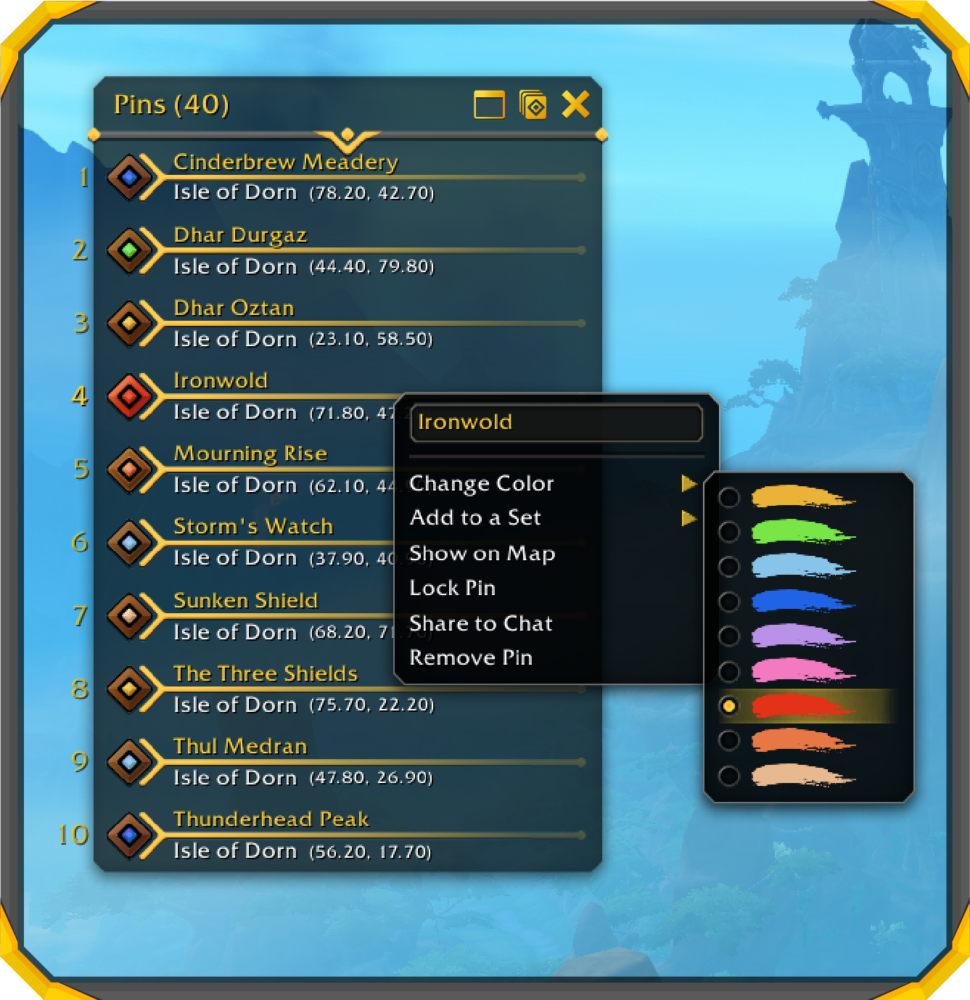
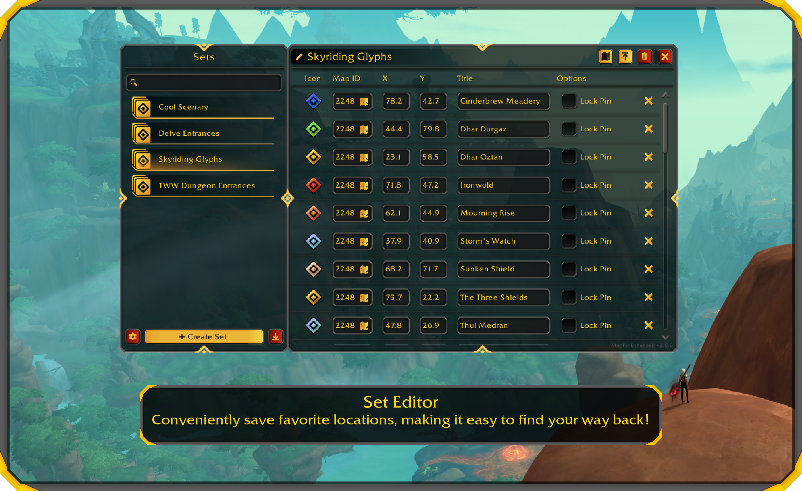
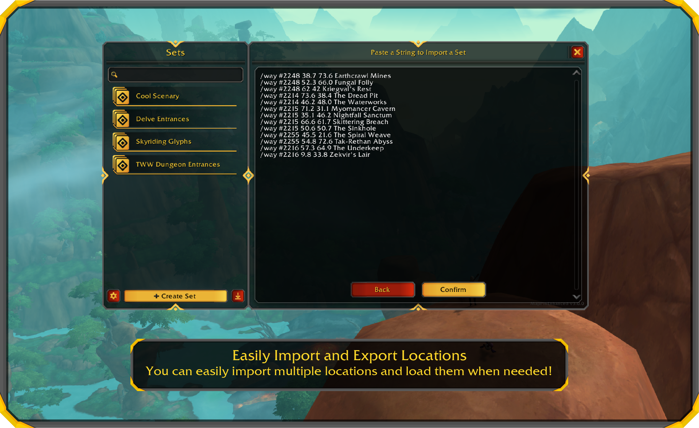
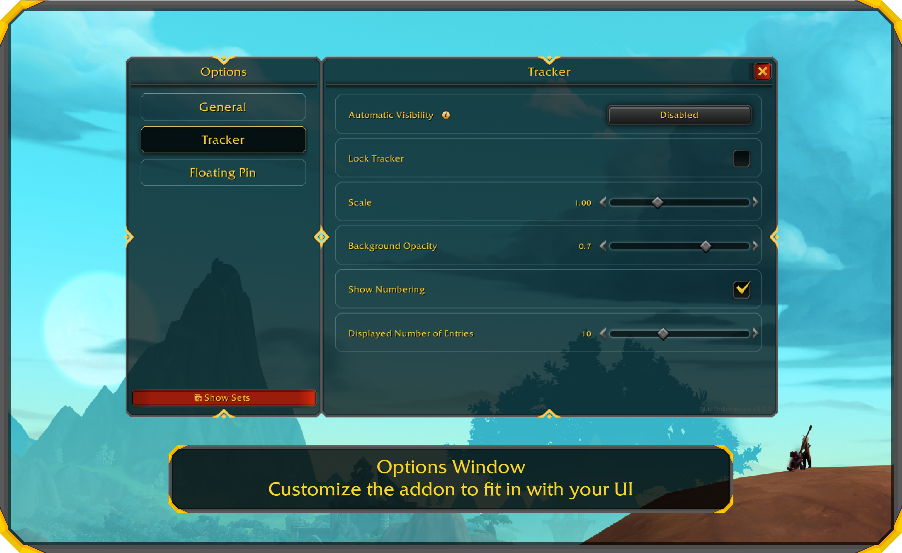

<h1 align="center"> Map Pin Enhanced </h1>  

    
    
    

  

  Map Pin Enhanced enhances the ingame waypoint system.

## Licensing Overview

This project is dual-licensed. The code is available under the GPLv3 license, while the media assets are under a more restrictive license.

- **Code:** Licensed under GNU General Public License v3.0 (GPLv3).
- **Media Assets:** Licensed under a Creative Commons Attribution-NonCommercial-NoDerivatives 4.0 International (CC BY-NC-ND 4.0).

Please review the LICENSE file for more details.

## Features

You can do these things with Map Pin Enhanced:

- Set as many waypoints as you want (no "one-waypoint" limit).
- Set waypoints via command: _/mph_, _/pin_ or _/way_.
- A pin tracker to see a list of all your pins.
- A set editor to create and manage your sets.
- Many improvements to the in-game waypoint system

## Pin Tracker

    

        
    

    

        <ul>
            <li>Save multiple Pins</li>
            <li>Change the pin title</li>
            <li>Customize the pin color</li>
            <li>Ping the pin on the map</li>
            <li>Lock the pin</li>
            <li>Share the pin</li>
        </ul>
    

## Set Editor

  

## Importing and Exporting Pins

  

## Options

  

## Contributions

We welcome any contributions from developers!
