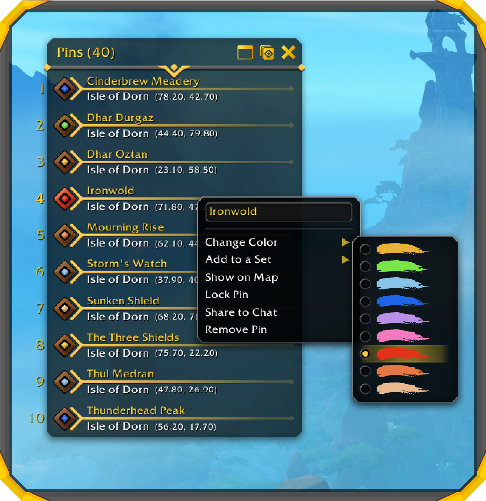
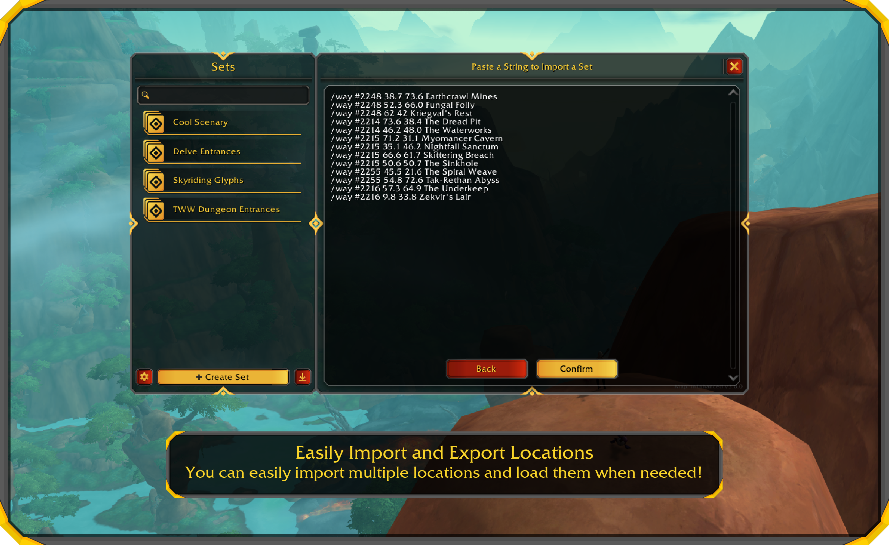
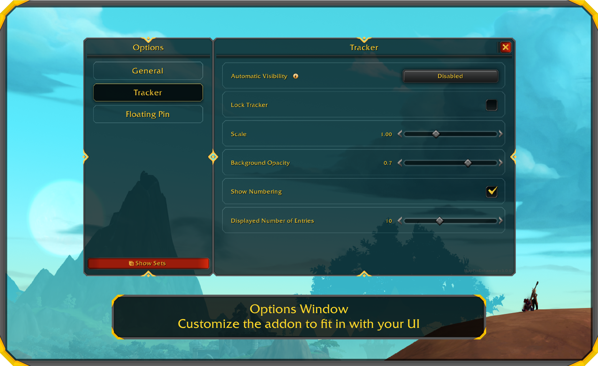

<h1 align="center"> Map Pin Enhanced </h1>  

    
    
    

  

  Map Pin Enhanced enhances the ingame waypoint system.

## Licensing Overview

This project uses separate terms for its source code and media assets.

- **Code:** Licensed under the GNU General Public License, version 3.0
  (GPL-3.0-only).
- **Media Assets:** Copyright © 2026 Nercus. All rights
  reserved. The assets are not licensed under the GPL and may not be reused,
  copied, modified, or redistributed without prior written permission, except
  as permitted by law.

See [LICENSE](LICENSE) and [ASSETS-LICENSE](ASSETS-LICENSE) for the exact scope
and terms. Bundled third-party libraries remain under their own licenses.

## Features

You can do these things with Map Pin Enhanced:

- Set as many waypoints as you want (no "one-waypoint" limit).
- Set waypoints via command: _/mph_, _/mpe or _/way_.
- A pin tracker to see a list of all your pins.
- An editor to create and manage your groups.
- Many improvements to the in-game waypoint system

## Pin Tracker

  
  
 Save multiple Pins | Change the pin title | Customize the pin color | Ping the pin on the map | Lock the pin | Share the pin 

## Importing and Exporting Pins

  

## Options

  

## Contributions

We welcome any contributions from developers!
